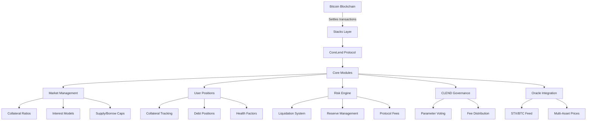

# CoreLend Protocol: Bitcoin-Backed Decentralized Lending

[](https://www.stacks.co)

CoreLend is a groundbreaking decentralized lending protocol that combines Bitcoin's unparalleled security with modern DeFi flexibility. As the first Bitcoin-settled lending protocol with native STX/BTC oracle pricing, CoreLend enables truly Bitcoin-centric financial operations while maintaining full compatibility with the Stacks ecosystem.

## Key Features

**Bitcoin-Centric Architecture**  
✅ Direct Bitcoin finality settlements  
✅ BTC-denominated positions with STX/BTC price feeds  
✅ Bitcoin-secured smart contracts via Stacks L2  

**Advanced Risk Management**  
⚖️ Dynamic collateral ratios (150%+ default)  
🚨 Multi-tier liquidation protection (125% threshold)  
📉 Dutch auction-style liquidations with penalty redistribution  

**Capital Efficiency**  
🔄 Cross-collateralization support  
📈 Algorithmic interest rate models  
💹 Reserve-backed yield generation  

**Enterprise-Grade Security**  
🛡️ Protocol-controlled reserves (30% reserve factor)  
🔒 Formal verification-ready Clarity contracts  
📊 Real-time position health monitoring  

**Governance & Interoperability**  
🗳️ CLEND token-based governance  
🔗 SIP-010 token standard compliance  
🧩 Modular risk parameter configuration  

## Protocol Mechanics

### Core Operations
1. **Supply Assets**
   - Deposit supported tokens as collateral
   - Earn interest from borrower utilization
   - Automatic CLEND token minting representing share

2. **Borrow Assets**
   - Borrow against collateral with risk-adjusted LTV
   - Pay origination fees (1% default)
   - Real-time interest accrual (5% base rate)

3. **Liquidations**
   - Dutch auction mechanism for fair asset distribution
   - 10% liquidation penalty incentive
   - Multi-collateral support for position protection

### Key Formulas
- **Health Factor**  
  `(Σ Collateral Value) / (Σ Borrow Value) ≥ 150%`
  
- **Interest Accrual**  
  `Interest = Principal × Rate × Time / (365 × PRECISION)`
  
- **Liquidation Bonus**  
  `Collateral Seized = (Debt Value × (1 + Penalty%)) / Collateral Price`

## Architecture Overview 🏛️



### Core Components

1. **Market Management**  
   - Configurable risk parameters per asset
   - Dynamic interest rate models
   - Supply/borrow ceilings for risk mitigation

2. **Position Engine**  
   - Cross-collateral accounting system
   - Block-based interest compounding
   - Collateral optimization algorithms

3. **Risk Framework**  
   - Dual-ratio system (Collateral/Liquidation)
   - Real-time health factor monitoring
   - Reserve-backed crisis mitigation

4. **Governance Layer**  
   - CLEND token-based voting
   - Protocol parameter adjustment
   - Treasury management controls

5. **Oracle System**  
   - Decentralized price feeds
   - STX/BTC valuation core
   - Multi-source aggregation layer

## Getting Started

### Developer Integration

1. **Interact with Markets**
```clarity
;; Query market parameters
(contract-call? .corelend get-market-details token-id)

;; Supply assets
(contract-call? .corelend supply token-id amount)

;; Borrow against collateral
(contract-call? .corelend borrow token-id amount)
```

2. **Price Oracle Access**
```clarity
;; Get current asset price
(contract-call? .corelend get-token-price token-id)

;; Calculate collateral value
(* (contract-call? .corelend get-token-price token-id) 
   (get supplied-position))
```

3. **Governance Participation**
```clarity
;; Submit governance proposal
(contract-call? .corelend submit-proposal 
  {:proposal-type "parameter-change"
   :target-market token-id
   :new-value 2000000})

;; Vote with CLEND tokens
(contract-call? .corelend cast-vote 
  proposal-id 
  (+ votes-held votes-delegated))
```
